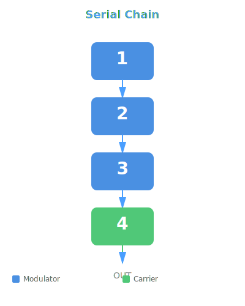
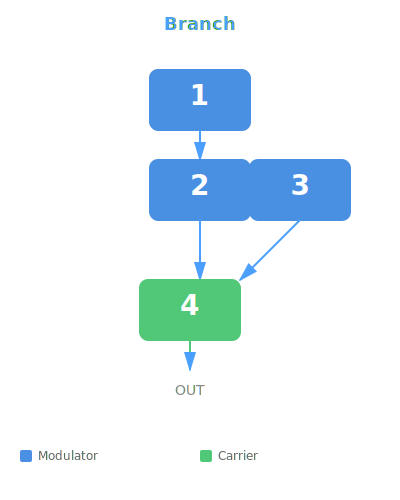
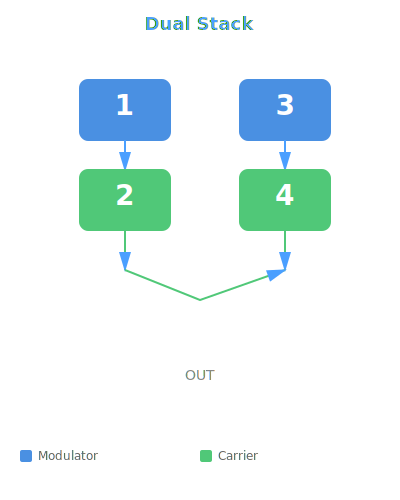
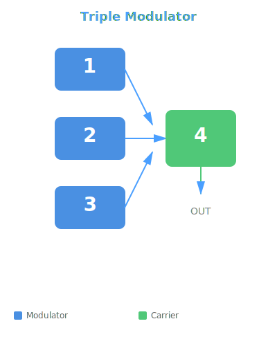
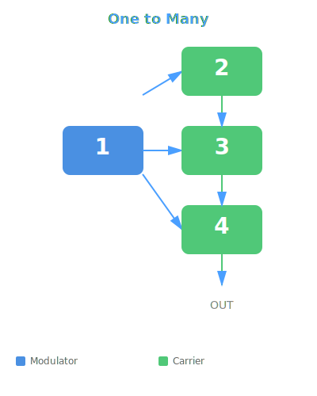
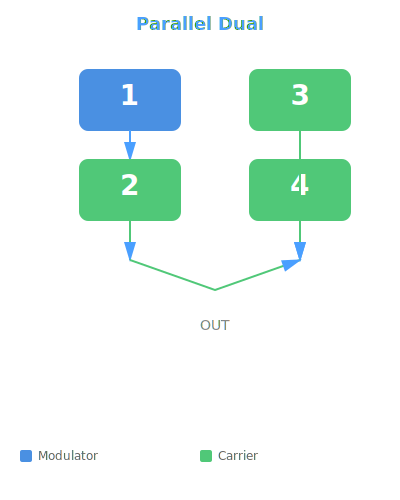
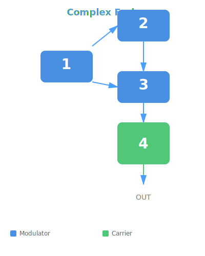
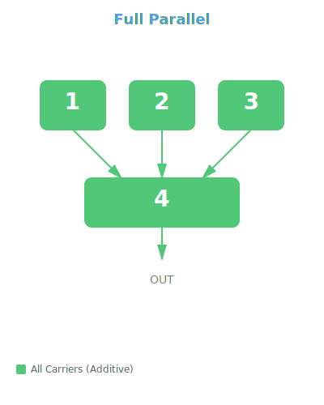

# Neon FM - Algorithm Reference

Visual reference for all 8 FM synthesis algorithms used in Neon FM.

## Algorithm 1: Serial Chain
Linear cascade through all operators.

**Topology:** 1 → 2 → 3 → 4 → OUT

---

## Algorithm 2: Branch
Two paths converge at operator 4.

**Topology:** (1 → 2 → 4) + (3 → 4) → OUT

---

## Algorithm 3: Dual Stack
Two independent FM pairs.

**Topology:** (1 → 2) + (3 → 4) → OUT

---

## Algorithm 4: Triple Modulator
Three modulators feeding a single carrier.

**Topology:** (1 + 2 + 3) → 4 → OUT

---

## Algorithm 5: One to Many
Single modulator feeding three independent carriers.

**Topology:** 1 → (2 + 3 + 4) → OUT

---

## Algorithm 6: Parallel Dual
One FM pair + two independent carriers.

**Topology:** (1 → 2) + 3 + 4 → OUT

---

## Algorithm 7: Complex Fork
One modulator to two operators, both feed the carrier.

**Topology:** 1 → (2, 3) → 4 → OUT

---

## Algorithm 8: Full Parallel
All operators independent (additive synthesis).

**Topology:** 1 + 2 + 3 + 4 → OUT

---

## Color Legend

- **Blue boxes** = Modulators (modifying operator, not directly audible)
- **Green boxes** = Carriers (directly audible output operators)
- **Arrows** = FM modulation routing
